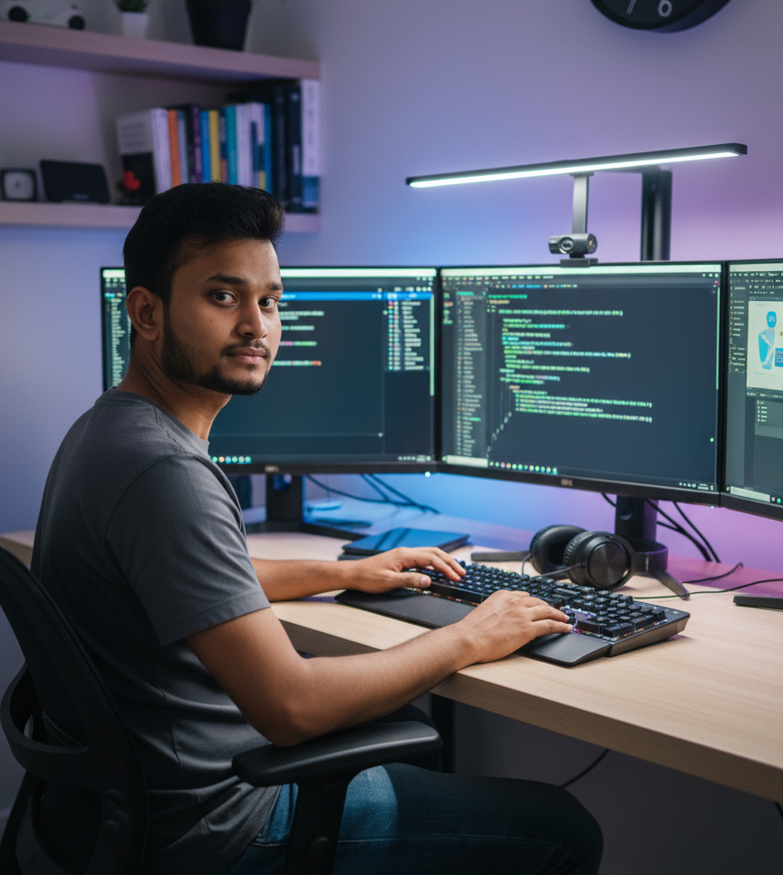

# Kuldeep Maurya - Full Stack Developer & Designer

Hi there 👋, I'm **Kuldeep Maurya**, a passionate MERN Stack and Java developer building modern, responsive, and user-friendly digital experiences.

---

## 📄 About Me
I’m a MERN Stack and Java developer with hands-on experience in building modern applications. Currently, I work as a Frontend Developer Intern at **Flourishers Edge Pvt. Ltd.**, developing websites using **Next.js, React, Tailwind CSS, and Framer Motion**.

I have developed real-world projects like a Real-Time Chat App, Admin Panel with RBAC, Propeller LED Display, Receipt Generator, and Recipe Generation System. I enjoy solving problems, writing clean code, and continuously learning new technologies.

---

## 🛠️ Skills
### Frontend
- React.js (90%)
- Next.js (88%)
- JavaScript (ES6+) (92%)
- TypeScript (80%)
- Tailwind CSS (90%)
- Framer Motion (85%)

### Backend
- Node.js (85%)
- Express.js (82%)
- MongoDB (80%)
- MySQL / SQL (78%)

### Programming
- Java (85%)

---

## 💻 Projects

<!-- ### 1. Flourishers Edge Corporate Website
**Subtitle:** Modern business website with animations & CMS integration  
**Technologies:** Next.js, React, Tailwind CSS, Sanity CMS, Framer Motion, Vercel  
**Description:** A fully responsive corporate website with dynamic CMS content.  
**Live:** [Visit Project](https://www.flourishersedge.com/)  

### 2. Hind Convent School Website
**Subtitle:** Complete school information & management system  
**Technologies:** Next.js, React, MongoDB, Node.js, Tailwind CSS, Framer Motion  
**Description:** School website providing notices, events, dynamic pages, and responsive UI.  
**Live:** [Visit Project](https://www.hindconventschool.com/)

### 3. Swatantra India News Portal
**Subtitle:** Digital news platform with CMS & PDF newspaper viewer  
**Technologies:** Next.js, Sanity CMS, Tailwind CSS, Framer Motion, PDF Viewer  
**Live:** [Visit Project](https://swatantra-india-news.vercel.app/) -->

### 4. Spinx Template
**Subtitle:** Premium modern landing page template  
**Technologies:** Next.js, React, Tailwind CSS, Framer Motion, Vercel  
**Live:** [Visit Project](https://spinx-template.vercel.app/) | **GitHub:** [View Repo](https://github.com/spideyO0/spinx-template)

### 5. Nova uPVC Commercial Website
**Technologies:** Next.js, Prismic, Slice Machine, Tailwind CSS  
**Live:** [Visit Project](https://generic-web-page.vercel.app/) | **GitHub:** [View Repo](https://github.com/spideyO0/novaupvc-landingpage-slicemachine)

<!-- ### 6. Tulip LMS (Learning Management System)
**Technologies:** React, Next.js, Tailwind CSS, Node.js  
**GitHub:** [View Repo](https://github.com/mehul7169/tulip-lms) -->

### 7. Text Summarizer
**Technologies:** Python, Flask, HTML, CSS  
**GitHub:** [View Repo](https://github.com/kuldeepmaurya4296/TextSummarizer)

### 8. TextUtils
**Technologies:** React, JavaScript, Bootstrap  
**Live:** [Visit Project](https://kuldeepmaurya4296.github.io/TextUtils-React/) | **GitHub:** [View Repo](https://github.com/kuldeepmaurya4296/TextUtils-React/)

---

## 📄 Resume
[Download My Resume](./public/resume.pdf)

---

## 🏢 Experience

- **Flourishers Edge Pvt. Ltd.** – Frontend Developer (2024 - Present)  
  Built modern, responsive websites using Next.js & Tailwind CSS.  
  Achievements:
  - Developed corporate website with animations & CMS integration  
  - Implemented scroll effects, responsive layouts & reusable components

- **Freelance / Personal Projects** – Full Stack Developer (2022 - 2024)  
  Built production-level websites, news portals, landing pages, and utility apps.

---

## 🎓 Education

- **B.Tech in Computer Science & Engineering – AIML** – Technocrats Institute of Technology (2020 - 2024) | CGPA: 88%  
- **Higher Secondary (Class 12th)** – Govt. Model H S School, Sitlaha, Rewa (2020) | Marks: 83.6%  
- **High School (Class 10th)** – Govt. Model H S School, Sitlaha, Rewa (2018) | Marks: 87.7%

---

## 📫 Contact Me

- Email: kuldeepmaurya4296@gmail.com  
- Phone: +91 6263638053  
- Location: Bhopal, Madhya Pradesh  

**Social Links:**  
[GitHub](https://github.com/kuldeepmaurya4296) | [LinkedIn](https://www.linkedin.com/in/kuldeepmaurya4296/) | [Whatsapp](https://wa.me/+916263638053)

---

*This README was generated based on my portfolio website data.*
